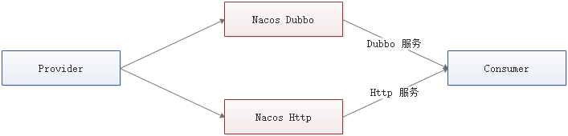

# Spring Cloud Alibaba Dubbo

## 博客

- [Spring Cloud Alibaba Dubbo](http://www.funtl.com/zh/spring-cloud-alibaba-dubbo-vue)

## 目标

Spring Cloud Alibaba Dubbo 项目的目标是将 Dubbo 融入到 Spring Cloud Alibaba 生态中，使微服务之间的调用同时具备 RESTful 和 Dubbo 调用的能力。做到对业务代码无侵入，无感知；引入 JAR 包则微服务间调用使用 Dubbo，去掉 JAR 包则使用默认的 RESTful；实现参考的是 Spring Cloud 中文社区的 [Spring Cloud Dubbo](https://github.com/SpringCloud/spring-cloud-dubbo) 项目。

## Nacos

既然已经将 Dubbo 集成进了 Spring Cloud Alibaba，那么理所当然的我们的注册中心也不再采用 Zookeeper 方案而是转为 Nacos 方案了，部署 Nacos 请参考我的 [**服务注册与发现**](http://www.funtl.com/zh/spring-cloud-alibaba/%E6%9C%8D%E5%8A%A1%E6%B3%A8%E5%86%8C%E4%B8%8E%E5%8F%91%E7%8E%B0.html) 章节

**注：截止到博客发表时间 2019 年 03 月 13 日，Nacos 已发行版为 0.9.0，在 0.8.0 时登录 Nacos 需要使用账号密码，默认账号密码为 nacos/nacos**

## 实现基于 Feign 的注册方案

由于 Nacos、Dubbo、Spring Cloud Alibaba 都是阿里系产品，所以我们可以很容的将 Dubbo 和 Http 服务注册到 Nacos 中。



此时服务提供者即注册了 Dubbo 又注册了 Http 服务，服务消费者根据配置方式可以在 Dubbo 与 Http 调用中随意切换

### 服务提供者

服务提供者在使用 Dubbo 注册服务时是需要使用 `@Service` 注解将服务注册到注册中心的，现在改用 `@FeignClient` 注解来注册

以 `spring-cloud-alibaba-dubbo-provider-api` 项目中定义的 API 接口为例

```java
package com.funtl.alibaba.dubbo.provider.service;

import org.springframework.cloud.openfeign.FeignClient;
import org.springframework.web.bind.annotation.GetMapping;

@FeignClient("provider")
public interface ProviderService {
    @GetMapping("/hi")
    String hi();
}
```

以 `spring-cloud-alibaba-dubbo-provider-service` 项目中实现接口为例

```java
package com.funtl.alibaba.dubbo.provider.service.impl;

import com.funtl.alibaba.dubbo.provider.service.ProviderService;
import org.springframework.web.bind.annotation.RestController;

@RestController
public class ProviderServiceImpl implements ProviderService {
    @Override
    public String hi() {
        return "Hi Spring Cloud Alibaba Dubbo";
    }
}
```

以上代码是一个典型的 Spring Cloud RESTFul API，服务提供者需要做的就是引入 Dubbo 相关依赖，扫描包含 `@FeignClient` 注解的类并注册到 Nacos 即可，关键代码在 `spring-cloud-alibaba-dubbo-core` 项目的 `FeignClientToDubboProviderBeanPostProcessor` 类中

```java
    /**
     * Registers Beans whose classes was annotated {@link FeignClient}
     *
     * @param packagesToScan The base packages to scan
     * @param registry       {@link BeanDefinitionRegistry}
     */
    private void registerServiceBeans(Set<String> packagesToScan, BeanDefinitionRegistry registry) {

        DubboClassPathBeanDefinitionScanner scanner =
                new DubboClassPathBeanDefinitionScanner(registry, environment, resourceLoader);

        BeanNameGenerator beanNameGenerator = resolveBeanNameGenerator(registry);

        scanner.setBeanNameGenerator(beanNameGenerator);

        scanner.addIncludeFilter(new AnnotationTypeFilter(FeignClient.class, true, true));

        for (String packageToScan : packagesToScan) {

            // Registers @Service Bean first
            scanner.scan(packageToScan);

            // Finds all BeanDefinitionHolders of @Service whether @ComponentScan scans or not.
            Set<BeanDefinitionHolder> beanDefinitionHolders =
                    findServiceBeanDefinitionHolders(scanner, packageToScan, registry, beanNameGenerator);

            if (!CollectionUtils.isEmpty(beanDefinitionHolders)) {

                for (BeanDefinitionHolder beanDefinitionHolder : beanDefinitionHolders) {
                    registerServiceBean(beanDefinitionHolder, registry, scanner);
                }

                if (logger.isInfoEnabled()) {
                    logger.info(beanDefinitionHolders.size() + " annotated Dubbo's @Service Components { " +
                            beanDefinitionHolders +
                            " } were scanned under package[" + packageToScan + "]");
                }

            } else {

                if (logger.isWarnEnabled()) {
                    logger.warn("No Spring Bean annotating Dubbo's @Service was found under package["
                            + packageToScan + "]");
                }

            }

        }

    }
```

### 服务消费者

服务消费者需要依赖 `spring-cloud-alibaba-dubbo-provider-api`，并直接使用 `@Autowired` 注解即可实现注入，可以不使用 Dubbo 提供的 `@Reference` 注解

```java
package com.funtl.alibaba.dubbo.consumer.service;

import com.funtl.alibaba.dubbo.provider.service.ProviderService;
import org.springframework.beans.factory.annotation.Autowired;
import org.springframework.web.bind.annotation.GetMapping;
import org.springframework.web.bind.annotation.RestController;

@RestController
public class TestService {

    @Autowired
    private ProviderService providerService;

    @GetMapping("/test")
    public String test() {
        return providerService.hi();
    }
}
```

以上代码是一个典型的 Spring Cloud Feign 调用。我们只需要替换 Feign 的实现。产生 `ProviderService` 接口的 `ProxyBean` 时，使用 Dubbo 产生的 Bean 替换默认的 Feign 产生的 RESTFul 调用的 Bean 即可，关键代码在 `spring-cloud-alibaba-dubbo-core` 项目的 `DubboFeignBuilder` 类中

```java
    @Override
    public <T> T target(Target<T> target) {
        ReferenceBeanBuilder beanBuilder = ReferenceBeanBuilder
                .create(defaultReference, target.getClass().getClassLoader(), applicationContext)
                .interfaceClass(target.type());

        try {
            T object = (T) beanBuilder.build().getObject();
            return object;
        } catch (Exception e) {
            throw new RuntimeException(e);
        }
    }
```

## 消费者使用 RESTFul 调用

只需将 Dubbo 相关依赖排除即可

```xml
<dependency>
    <groupId>com.funtl</groupId>
    <artifactId>spring-cloud-alibaba-dubbo-starter</artifactId>
    <exclusions>
        <exclusion>
            <groupId>com.funtl</groupId>
            <artifactId>spring-cloud-alibaba-dubbo-core</artifactId>
        </exclusion>
        <exclusion>
            <groupId>com.alibaba.boot</groupId>
            <artifactId>dubbo-spring-boot-starter</artifactId>
        </exclusion>
    </exclusions>
</dependency>
```
